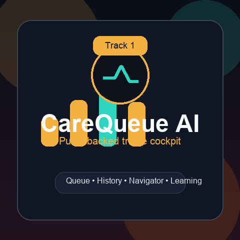

# HealthGuard AI

> AI healthcare navigator connecting underserved patients with clinical insights, vitals monitoring, and real-time alerts — powered by Gemini with multi-model orchestration.

[](https://www.geminixprize.com)
[](https://xprize.devpost.com)
[](https://nextjs.org)
[](https://typescriptlang.org)
[](LICENSE)



---

## The Problem

Healthcare inaccessibility is a daily crisis. In the U.S. alone:

- **45 million** people live without health insurance
- **100 million+** are underinsured, delaying or skipping necessary care
- **26 days** average wait time to see a primary care physician
- Rural areas face wait times stretching into **months**

For a single mother noticing her child's persistent fever at midnight, or an elderly patient experiencing irregular heart palpitations on a Sunday, the gap between noticing a symptom and receiving clinical guidance can be insurmountable. People turn to Dr. Google, fall down WebMD rabbit holes, and either panic over benign conditions or dismiss genuinely dangerous warning signs.

## Our Solution

**HealthGuard AI** is a Gemini-powered clinical decision support platform that gives patients and frontline health workers instant access to intelligent health monitoring — no appointment needed.

```
┌──────────────┐     ┌─────────────┐     ┌──────────────┐     ┌──────────────┐
│   PATIENT     │────▶│  VITALS     │────▶│  AUTO-ALERT  │────▶│  GEMINI AI   │
│   DATA        │     │  MONITORING │     │  ENGINE      │     │  ASSISTANT   │
│              │     │  (Charts)   │     │  (Real-time) │     │  (Chat)      │
└──────────────┘     └─────────────┘     └──────────────┘     └──────────────┘
                                                                  │
                                                                  ▼
                                                           ┌──────────────┐
                                                           │  CLINICAL    │
                                                           │  GUIDANCE    │
                                                           │  + ACTIONS   │
                                                           └──────────────┘
```

### Core Capabilities

**Real-Time Vitals Monitoring** — Track heart rate, blood pressure, SpO2, and temperature with interactive charts and trend analysis.

**Automatic Clinical Alerting** — Every vitals reading is evaluated against evidence-based clinical thresholds. Abnormal values trigger severity-graded alerts (critical / warning / informational) instantly.

**Gemini-Powered AI Health Assistant** — Ask questions in natural language and receive clinically-informed responses that cross-reference patient history, conditions, medications, and vitals trends. Quick actions for health summaries and alert reviews.

**Patient Management** — Structured records for demographics, conditions, medications, and complete vitals history per patient.

## Live Demo

| Tab | Description |
|-----|-------------|
| **Dashboard** | Stats overview, heart rate trends, alert severity breakdown, recent activity |
| **AI Assistant** | Full Gemini chat with patient context, quick actions, health summaries |
| **Patients** | Patient cards, vitals history charts, add patients and readings |
| **Alerts** | Filterable alert list (critical/warning/info), acknowledge, sort by severity |

### Seeded Demo Data

| Patient | Profile | Key Condition | Alerts |
|---------|---------|---------------|--------|
| Sarah Johnson | 34F | Hypertension | Elevated BP trending above 140 systolic |
| Marcus Chen | 58M | Type 2 Diabetes + CAD | Critical fasting glucose spike |
| Elena Rodriguez | 72F | COPD + Atrial Fibrillation | Low SpO2 episodes below 92% |

## Architecture

```
src/
├── app/
│   ├── page.tsx                          # 4-tab SPA (Dashboard, AI, Patients, Alerts)
│   ├── layout.tsx                        # Root layout with metadata
│   ├── globals.css                       # Teal/emerald healthcare theme
│   └── api/
│       ├── chat/route.ts                 # Gemini-powered health assistant (POST)
│       ├── patients/route.ts             # Patient CRUD (GET, POST)
│       ├── patients/[id]/vitals/route.ts # Vitals history + auto-alerts (GET, POST)
│       ├── alerts/route.ts               # Alert listing + acknowledge (GET, PATCH)
│       └── dashboard/route.ts            # Aggregated stats (GET)
├── components/
│   └── ui/                               # shadcn/ui component library
├── lib/
│   ├── db.ts                             # Prisma client
│   └── utils.ts                          # Utility functions
└── hooks/                                # React hooks
prisma/
├── schema.prisma                         # Patient, VitalsReading, Alert models
├── seed.ts                               # 3 patients, 39 vitals readings, 7 alerts
└── custom.db                             # SQLite database
docs/
├── project-story.md                      # Devpost project story
├── video-script.md                       # 3-minute demo video script
└── diagrams/                             # D2 architecture diagrams
```

## Quick Start

### Prerequisites

- Node.js 18+ and Bun
- A Google Gemini API key (via z-ai-web-dev-sdk)

### Installation

```bash
git clone https://github.com/icohangar-ops/healthguard-ai.git
cd healthguard-ai
bun install
bun run db:push
bun run dev
```

The app runs on `http://localhost:3000`.

### Environment Setup

The z-ai-web-dev-sdk handles Gemini authentication automatically. No additional `.env` configuration is required for the SDK.

## Tech Stack

| Layer | Technology |
|-------|-----------|
| Framework | Next.js 16 (App Router) |
| Language | TypeScript 5 |
| Styling | Tailwind CSS 4 + shadcn/ui |
| Charts | Recharts |
| Animations | Framer Motion |
| Database | Prisma ORM + SQLite |
| AI | Google Gemini via z-ai-web-dev-sdk |
| Icons | Lucide React |

## API Endpoints

| Endpoint | Method | Description |
|----------|--------|-------------|
| `/api/chat` | POST | Gemini health assistant with patient context |
| `/api/patients` | GET | List all patients with latest vitals + alert counts |
| `/api/patients` | POST | Create a new patient |
| `/api/patients/[id]/vitals` | GET | Vitals history with date range filtering |
| `/api/patients/[id]/vitals` | POST | Add vitals reading + auto-generate alerts |
| `/api/alerts` | GET | List alerts (filterable by type/acknowledged) |
| `/api/alerts` | PATCH | Acknowledge an alert |
| `/api/dashboard` | GET | Aggregated dashboard statistics |
| `/api/consult/token` | POST | Mint an Agora RTC token and open a consult session |
| `/api/consult/navigator` | POST/DELETE | Start/stop the spoken voice navigator |
| `/api/consult/transcript` | POST/DELETE | Start/stop live captions |
| `/api/consult/record` | POST/DELETE | Start/stop the recorded visit record |

## Talk to it, or escalate to a human

The navigator started out text-only, which quietly excludes the people this
product is for — someone at midnight with a feverish child, an elderly patient
with a tremor, anyone who reads slowly or not at all in the interface language.

Two additions close that gap, both built on [Agora](https://console.agora.io/):

- **A navigator you can talk to.** Agora's Conversational AI Engine handles
  speech in and out, but calls back into this app for the thinking — so the
  spoken navigator and the typed chat share one brain and one set of
  never-diagnose safety rules.
- **A clinician you can escalate to.** When the AI has gone as far as it safely
  can, `ConsultRoom` puts the patient and a real clinician on live video, with
  optional live captions and a recorded visit record.

**PHI is gated in code.** Sending identifiable patient data to Agora requires a
signed Business Associate Agreement, which is an enterprise arrangement — the
free console tier does not include one. So the default posture is
`transport-only`: consults and the voice navigator work, but no patient chart
reaches the model and nothing is recorded. Recording, stored transcripts, and
chart-aware prompting stay locked until an operator sets both
`AGORA_PHI_POSTURE=baa-signed` and `AGORA_BAA_REFERENCE=<contract ref>`.

Full architecture, posture matrix, and setup: [docs/agora-telehealth.md](docs/agora-telehealth.md).

## Auto-Alert Clinical Thresholds

| Vital | Warning | Critical |
|-------|---------|----------|
| Heart Rate | > 100 or < 50 bpm | > 120 or < 40 bpm |
| Systolic BP | > 140 mmHg | > 180 mmHg |
| Diastolic BP | > 90 mmHg | > 120 mmHg |
| SpO2 | < 95% | < 92% |
| Temperature | > 100.4 F | > 103 F or < 95 F |

Thresholds based on AHA/ACC 2017 guidelines.

## XPRIZE: Build with Gemini

**Category:** Professional Services Access

> "Healthcare navigation for uninsured" — the official example use case for this category.

### Judging Criteria Alignment

| Criterion (33.3% each) | How HealthGuard AI Delivers |
|------------------------|---------------------------|
| **Business Viability** | Freemium tier for patients, $29/mo pro for health workers, enterprise for clinics |
| **AI-Native Operations** | AI actively monitors vitals, generates alerts, provides clinical analysis — not a bolted-on chatbot |
| **Category Impact** | Directly addresses healthcare access gap for 45M+ uninsured Americans |

## Built With

- [Google Gemini](https://ai.google.dev/) — Primary AI intelligence layer
- [Next.js](https://nextjs.org/) — React framework
- [shadcn/ui](https://ui.shadcn.com/) — Component library
- [Prisma](https://prisma.io/) — Database ORM
- [Recharts](https://recharts.org/) — Data visualization
- [Framer Motion](https://www.framer.com/motion/) — Animations

## Related Repos

| Repository | Role |
|-----------|------|
| [Senso.AI Knowledge Base](https://github.com/Cubiczan/senso-ai-knowledge-base) | Medical knowledge graph |
| [Senso Agent Runtime](https://github.com/Cubiczan/senso-agent-runtime) | Multi-model AI agent framework |
| [CFO Resilience Matrix](https://github.com/icohangar-ops/cfo-resilience-matrix) | LLM resilience patterns |

## License

MIT — see [LICENSE](LICENSE)
